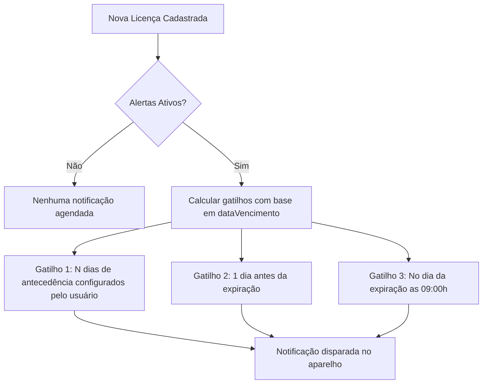

# SIGS — Gestão Sanitária Digital
> **Sistema Inteligente de Gerenciamento de Licenças e Inspeções Sanitárias/Veterinárias**

O **SIGS** é um aplicativo móvel híbrido desenvolvido com **React Native** e **Expo**, projetado para automatizar o controle de vencimento de licenças sanitárias e veterinárias, gerenciar inspeções técnicas de fiscalização e enviar notificações preditivas de expiração.

Com uma interface moderna, o SIGS permite que estabelecimentos e fiscais mantenham a conformidade legal de forma simples e segura, com armazenamento local robusto e suporte offline completo.

---

## 📱 Recursos Principais

* **📊 Painel de Controle (Dashboard):** Visualização rápida de métricas essenciais (total de licenças, ativas, suspensas, vencidas ou vencendo em breve) com gráficos e contadores dinâmicos.
* **📋 Filtro e Busca Avançados:** Busca textual instantânea por nome do estabelecimento ou código da licença (`L001`, `L002`, etc.) combinada com filtros rápidos por tipo (Sanitária ou Veterinária) e status.
* **📅 Calendário de Vencimentos:** Calendário mensal interativo destacando os dias exatos de expiração das licenças com marcadores coloridos por nível de urgência.
* **🔔 Alertas e Notificações Inteligentes:** Notificações locais automáticas baseadas em regras de antecedência configuráveis (1, 3, 7, 15 ou 30 dias antes do vencimento).
* **📸 Escaneamento de Documentos:** Integração com a câmera do dispositivo para fotografar e anexar a imagem física das licenças sanitárias ou veterinárias.
* **🔍 Histórico de Inspeções:** Registro detalhado de auditorias e visitas de fiscais atrelado a cada licença, incluindo resultado (Aprovado, Reprovado ou Pendente), observações e identificação do fiscal.
* **💾 Armazenamento 100% Offline (SQLite):** Banco de dados local relacional garantindo segurança de dados, alta performance e funcionamento em locais sem acesso à internet.

---

## 🛠️ Arquitetura e Estrutura de Diretórios

O projeto segue uma estrutura modular, limpa e bem delimitada para facilitar a escalabilidade e manutenção:

```
sigs-app/
├── assets/                 # Imagens, ícones e fontes do aplicativo
├── src/
│   ├── components/         # Componentes visuais reutilizáveis (cards, headers, chips)
│   │   ├── AppHeader.js    # Cabeçalho padrão das telas
│   │   ├── KpiCard.js      # Card de indicador estatístico do Dashboard
│   │   ├── LicencaCard.js  # Card com informações de licença nas listagens
│   │   └── InspecaoCard.js # Card com detalhes de uma auditoria técnica
│   ├── database/           # Configuração e queries do banco de dados local
│   │   └── database.js     # Serviço SQLite e criação de tabelas relacionais
│   ├── screens/            # Telas principais da aplicação (views)
│   │   ├── DashboardScreen.js   # Painel com gráficos e atalhos rápidos
│   │   ├── LicencasScreen.js    # Listagem geral com filtros e dados de teste
│   │   ├── DetalheLicencaScreen.js # Detalhes da licença, ações e inspeções
│   │   ├── CadastroScreen.js    # Formulário de criação de licença com câmera
│   │   ├── EditarLicencaScreen.js # Edição, renovação e inserção de inspeções
│   │   ├── CalendarioScreen.js  # Visualização de vencimentos no calendário
│   │   ├── AlertasScreen.js     # Central de pendências e notificações visualizadas
│   │   └── ConfiguracoesScreen.js # Ajustes de antecedência e ativação de alarmes
│   ├── store/              # Gerenciamento de estado global com Zustand
│   │   ├── licencasStore.js # Estado das licenças, filtros e persistência DB
│   │   ├── alertsStore.js   # Controle de leitura de notificações (lido/não lido)
│   │   └── settingsStore.js # Preferências do usuário persistidas com AsyncStorage
│   ├── theme/              # Definições de design system
│   │   └── colors.js       # Cores padrão (Brand Emerald), espaçamentos e fontes
│   └── utils/              # Funções auxiliares e formatadores
│       ├── formatters.js   # Tratamento de datas, CNPJ e geração de IDs/Códigos
│       ├── alertsHelper.js # Gerador de alertas de vencimento estruturado
│       └── notifications.js# Agendamento e cancelamento de notificações no Expo
├── App.js                  # Ponto de entrada, configuração do React Navigation e temas
├── app.json                # Configuração do Expo (permissões da câmera, ícone, etc.)
└── package.json            # Dependências e scripts npm/yarn
```

---

## 🗄️ Modelo de Dados (SQLite)

O SIGS utiliza a biblioteca nativa `expo-sqlite` para armazenar as entidades localmente de forma relacional. O esquema do banco de dados é composto por duas tabelas principais com relacionamento de chave estrangeira (`1:N`):

### 1. Tabela `licencas`
Guarda as informações cadastrais de cada estabelecimento e sua respectiva licença.

| Campo | Tipo SQLite | Descrição |
| :--- | :--- | :--- |
| `id` 🔑 | `TEXT` | ID único em formato UUID gerado na criação |
| `codigo` | `TEXT` | Código incremental sequencial formatado (ex: `L001`, `L002`) |
| `nome` | `TEXT` | Razão Social do Estabelecimento |
| `cnpj` | `TEXT` | Cadastro Nacional da Pessoa Jurídica (14 dígitos) |
| `endereco` | `TEXT` | Endereço completo do estabelecimento |
| `telefone` | `TEXT` | Telefone de contato (opcional) |
| `email` | `TEXT` | Endereço de e-mail de contato (opcional) |
| `responsavel` | `TEXT` | Nome do Responsável Técnico |
| `crmv` | `TEXT` | Registro no Conselho Regional de Medicina Veterinária (opcional) |
| `tipo` | `TEXT` | Tipo de licença: `'veterinaria'` ou `'sanitaria'` |
| `status` | `TEXT` | Status atual da licença: `'ativa'`, `'pendente'`, `'vencida'` ou `'suspensa'` |
| `dataEmissao` | `TEXT` | Data de emissão (formato `AAAA-MM-DD`) |
| `dataVencimento` | `TEXT` | Data de expiração (formato `AAAA-MM-DD`) |
| `anexoUri` | `TEXT` | Caminho do arquivo da imagem da licença no armazenamento local |

### 2. Tabela `inspecoes`
Guarda as vistorias técnicas executadas em cada estabelecimento. Possui exclusão em cascata vinculada à licença correspondente.

| Campo | Tipo SQLite | Descrição |
| :--- | :--- | :--- |
| `id` 🔑 | `TEXT` | ID único da vistoria técnica |
| `licencaId` 🔗 | `TEXT` | Chave estrangeira ligada à tabela `licencas` (`ON DELETE CASCADE`) |
| `data` | `TEXT` | Data em que a inspeção foi realizada (`AAAA-MM-DD`) |
| `resultado` | `TEXT` | Resultado da auditoria: `'aprovado'`, `'reprovado'` ou `'pendente'` |
| `observacoes` | `TEXT` | Detalhamento dos pontos auditados ou irregularidades encontradas |
| `fiscal` | `TEXT` | Nome do fiscal responsável pela vistoria |

---

## ⚡ Fluxo de Controle e Notificações de Vencimento

A lógica de notificações locais é executada em três momentos distintos com base na data de vencimento de cada licença:



Quando uma licença é editada, renovada ou excluída, o aplicativo limpa automaticamente a fila de notificações agendadas correspondentes no `expo-notifications` para garantir que o usuário não receba alertas desatualizados.

---

## 🚀 Como Executar o Projeto Localmente

### Pré-requisitos
* **Node.js** instalado (versão LTS recomendada).
* **NPM** ou **Yarn** instalado.
* Aplicativo **Expo Go** instalado no seu dispositivo móvel (iOS ou Android) para testes em tempo real, ou um simulador configurado.

### Passos para Instalação

1. **Clone o repositório:**
   ```bash
   git clone https://github.com/luann8/sigs-app.git
   cd sigs-app
   ```

2. **Instale as dependências:**
   ```bash
   npm install
   ```

3. **Inicie o servidor de desenvolvimento do Expo:**
   ```bash
   npm run start
   ```

4. **Abra o aplicativo:**
   * **No Android/iOS real:** Abra o app *Expo Go*, escaneie o código QR gerado no terminal com a câmera do celular ou através da aba dedicada do Expo Go.
   * **No Emulador Android:** Pressione `a` no terminal com o emulador aberto.
   * **No Simulador iOS:** Pressione `i` no terminal com o simulador aberto.

---

## 👨‍💻 Contribuição e Desenvolvimento

Para compreender melhor a modelagem técnica do projeto, as stores do Zustand e a lógica detalhada de notificações locais, consulte a documentação técnica avançada em:
👉 [**docs/ARCHITECTURE.md**](file:///home/luann8/GitHub/sigs-app/docs/ARCHITECTURE.md) (com especificações de API e diagramas de fluxo de dados).
# sigs-apps-online
