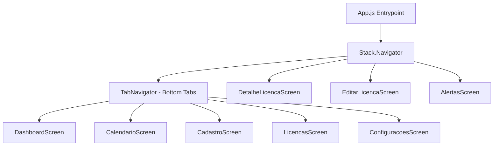

# Especificação Técnica de Arquitetura — SIGS

Este documento detalha as definições arquiteturais, padrões de projeto e fluxos técnicos implementados no **SIGS (Gestão Sanitária Digital)**.

---

## 🧭 Fluxo de Navegação e Telas

O fluxo de navegação do aplicativo é implementado com a biblioteca **React Navigation**, utilizando uma estrutura híbrida composta por um navegador em abas inferiores (**Bottom Tab Navigator**) e uma pilha nativa (**Native Stack Navigator**).

### Diagrama de Navegação



* **RootStack (Stack.Navigator):** Controla telas de overlay ou fluxo detalhado que cobrem a barra de abas inferior. A animação padrão configurada é `slide_from_right`.
* **TabNavigator (Tab.Navigator):** Gerencia as cinco áreas principais do aplicativo. O botão de cadastro no meio é um componente customizado (`CadastroTabButton`) estilizado como um FAB (Floating Action Button) destacado.

---

## 💾 Banco de Dados Local (SQLite)

O banco de dados SQLite é inicializado imediatamente no momento da importação do store de licenças (`src/store/licencasStore.js`), chamando a função `initDatabase()` exportada de `src/database/database.js`.

### Inicialização e Migração Dinâmica
```javascript
import * as SQLite from 'expo-sqlite';
const db = SQLite.openDatabaseSync('sigs.db');

export const initDatabase = () => {
  db.execSync(`
    CREATE TABLE IF NOT EXISTS licencas (
      id TEXT PRIMARY KEY NOT NULL,
      codigo TEXT NOT NULL,
      ...
      anexoUri TEXT
    );
    CREATE TABLE IF NOT EXISTS inspecoes (
      id TEXT PRIMARY KEY NOT NULL,
      licencaId TEXT NOT NULL,
      ...
      FOREIGN KEY (licencaId) REFERENCES licencas (id) ON DELETE CASCADE
    );
  `);

  // Migração manual caso a coluna anexoUri não exista em instalações antigas
  try {
    db.execSync('ALTER TABLE licencas ADD COLUMN anexoUri TEXT;');
  } catch (e) {
    // A coluna já existe, ignorar erro de alteração de tabela
  }
};
```

### Funções do DatabaseService
O `DatabaseService` expõe uma interface síncrona/reativa para interagir com o SQLite utilizando as funções `db.getAllSync()`, `db.runSync()` e execução de transações:
* **`getLicencas()`:** Obtém todas as licenças ordenadas de forma ascendente pela data de vencimento (`dataVencimento ASC`). Para cada linha de licença, executa uma busca pelas inspeções associadas (`SELECT * FROM inspecoes WHERE licencaId = ?`) e retorna um objeto aninhado contendo o vetor de inspeções.
* **`addLicenca(licenca)`:** Insere um novo registro com todos os campos cadastrais e caminhos de anexos.
* **`updateLicenca(id, updates)`:** Atualiza campos dinamicamente. Constrói uma cláusula `SET` sql com base nas chaves presentes no objeto `updates` para evitar query builders externos complexos.
* **`deleteLicenca(id)`:** Exclui uma licença. O relacionamento `FOREIGN KEY (licencaId) REFERENCES licencas (id) ON DELETE CASCADE` garante que todas as inspeções vinculadas sejam removidas automaticamente pelo motor SQLite.
* **`addInspecao(inspecao)`:** Registra uma nova auditoria técnica para uma licença.

---

## ⚡ Gerenciamento de Estado (Zustand)

O estado global da aplicação é descentralizado em três stores do **Zustand**, separando responsabilidades de negócio, controle de interface e preferências persistidas.

### 1. `licencasStore.js`
Store central de dados que sincroniza o estado em memória do React com as escritas no banco de dados SQLite.

* **Estados Globais:**
  * `licencas` (Array): Lista na memória contendo todas as licenças e suas respectivas inspeções.
  * `searchQuery` (String): String usada para filtrar a busca textual.
  * `filterTipo` (String): Tipo selecionado (`'todas'`, `'veterinaria'`, `'sanitaria'`).
  * `filterStatus` (String): Status selecionado (`'todas'`, `'ativa'`, `'pendente'`, `'vencida'`, `'suspensa'`).
* **Principais Ações (Actions):**
  * `loadLicencas()`: Busca dados no SQLite via `DatabaseService.getLicencas()` e atualiza o estado local.
  * `addLicenca(licenca)`: Salva no SQLite e atualiza o estado interno inserindo o elemento no início do array.
  * `updateLicenca(id, updates)`: Modifica campos no SQLite e atualiza o estado mapeando o array.
  * `deleteLicenca(id)`: Remove do SQLite e filtra o array local.
  * `getFilteredLicencas()`: Computa de forma memorizada as licenças correspondentes aos termos de busca e filtros ativos.

### 2. `settingsStore.js`
Gerencia preferências do usuário e regras de alerta. Utiliza o middleware `persist` combinando Zustand com `@react-native-async-storage/async-storage` para persistência automática.

* **Estados Globais:**
  * `alertasAtivos` (Boolean): Indica se os alarmes automáticos locais estão habilitados.
  * `diasAntecedencia` (Number): Quantidade de dias antes do vencimento para o primeiro alerta (padrão: `7` dias).
* **Principais Ações:**
  * `setAlertasAtivos(ativo)`: Modifica preferência e dispara reagendamento.
  * `setDiasAntecedencia(dias)`: Altera intervalo e reorganiza gatilhos.

### 3. `alertsStore.js`
Controla os alertas que já foram visualizados pelo usuário na central de avisos, evitando badges repetidas. Salva as informações localmente no AsyncStorage.

* **Estados Globais:**
  * `seenIds` (Array): Array de strings com IDs de alertas que o usuário já viu. Um ID é gerado no formato `{status/urgencia}-{licencaId}` (ex: `urgente-xyz123`, `vencida-abc987`).
* **Principais Ações:**
  * `markAsSeen(ids)`: Faz merge dos novos IDs com a lista de vistos.
  * `isSeen(id)`: Retorna verdadeiro se o alerta específico já foi visto.
  * `countUnseen(alertas)`: Retorna a quantidade de alertas novos (não vistos) a partir de uma lista gerada em tempo de execução.

---

## 📷 Captura e Anexo de Arquivos (Câmera)

A funcionalidade de escaneamento de licenças do app SIGS usa a biblioteca `expo-camera` (`CameraView`) e `expo-file-system`.

1. **Permissões:** O app solicita permissões para acessar a câmera usando `useCameraPermissions()`.
2. **Captura Temporária:** Ao tirar a foto com `cameraRef.takePictureAsync()`, uma imagem é gerada na pasta de cache temporário do sistema operacional.
3. **Cópia Permanente:** Para evitar perda de dados por limpeza de cache do sistema operacional, o app extrai o nome do arquivo e o copia para a pasta permanente de documentos do aplicativo:
   ```javascript
   const filename = photo.uri.split('/').pop();
   const newPath = `${FileSystem.documentDirectory}${filename}`;
   await FileSystem.copyAsync({
     from: photo.uri,
     to: newPath
   });
   setAnexoUri(newPath); // URI que inicia com 'file://...' persistida no banco
   ```

---

## 🔔 Motor de Notificações Locais (`expo-notifications`)

As notificações locais são agendadas de forma assíncrona. Quando o aplicativo é aberto pela primeira vez, chama a função `requestPermissionsAsync()` e agenda todos os alarmes se os alertas estiverem ativos.

### Agendamento de Gatilhos de Data
A função `agendarNotificacaoVencimento(licenca)` calcula até 3 datas de disparo (`trigger`) para cada licença.

#### Gatilho 1: Notificação de Antecedência
Agenda um disparo para `N` dias antes da expiração, às **09:00 AM**:
```javascript
const triggerN = new Date(dataVenc);
triggerN.setDate(triggerN.getDate() - diasAntecedencia);
// Dispara se triggerN for no futuro
```

#### Gatilho 2: Notificação de Véspera (1 dia antes)
Se o intervalo de antecedência configurado for diferente de 1 dia, agenda um alerta extra de aviso rápido para 24 horas antes do vencimento:
```javascript
const trigger1 = new Date(dataVenc);
trigger1.setDate(trigger1.getDate() - 1);
```

#### Gatilho 3: Notificação do Dia do Vencimento
Agenda uma notificação crítica para o próprio dia da expiração às **09:00 AM** para alertar sobre a perda de validade legal.

### Resolução de Metadados nas Notificações
Os agendamentos enviam dados adicionais no payload (`data`) contendo o ID da licença e a tela para onde o usuário deve ser redirecionado se clicar no alerta:
```javascript
content: {
  title: '🔴 Licença vence hoje',
  body: `"${licenca.nome}" vence hoje. Acesse o SIGS para renovar.`,
  data: { licencaId: licenca.id, screen: 'DetalheLicenca' }
}
```

### Limpeza e Cancelamento
Para evitar duplicação ou o envio de notificações de licenças que já foram renovadas ou excluídas, a função `cancelarNotificacoesDaLicenca(licencaId)` busca todos os agendamentos cadastrados no sistema operacional e cancela aqueles que possuem o ID correspondente:
```javascript
export async function cancelarNotificacoesDaLicenca(licencaId) {
  const scheduled = await Notifications.getAllScheduledNotificationsAsync();
  for (const n of scheduled) {
    if (n.content.data?.licencaId === licencaId) {
      await Notifications.cancelScheduledNotificationAsync(n.identifier);
    }
  }
}
```
Consultar a implementação completa no arquivo [src/utils/notifications.js](file:///home/luann8/GitHub/sigs-app/src/utils/notifications.js).
